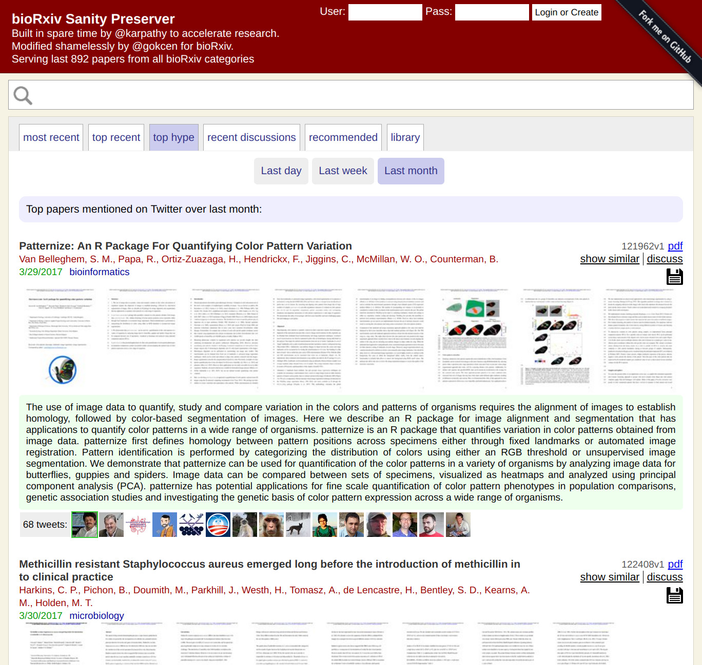

# bioRxiv sanity preserver (a fork of [arxiv sanity preserver](https://github.com/karpathy/arxiv-sanity-preserver))

This project is a web interface that attempts to tame the overwhelming flood of papers on bioRxiv. It allows researchers to keep track of recent papers, search for papers, sort papers by similarity to any paper, see recent popular papers, to add papers to a personal library, and to get personalized recommendations of (new or old) bioRxiv papers. This code is currently running live at [www.biorxiv-sanity.com/](http://www.biorxiv-sanity.com/), where it's serving 1,000+ papers from all bioRxiv categories over the last ~3 months.

### Code layout

There are two large parts of the code:

**Indexing code**. Uses bioRxiv RSS feeds to download the most recent papers, and then downloads all papers, extracts all text, creates tfidf vectors based on the content of each paper. This code is therefore concerned with the backend scraping and computation: building up a database of biorxiv papers, calculating content vectors, creating thumbnails, computing SVMs for people, etc.

**User interface**. Then there is a web server (based on Flask/Tornado/sqlite) that allows searching through the database and filtering papers by similarity, etc.

Implementation detailes are same as those for the original arxiv-sanity-preserver. Please see the original [README](https://github.com/karpathy/arxiv-sanity-preserver) for more details.
